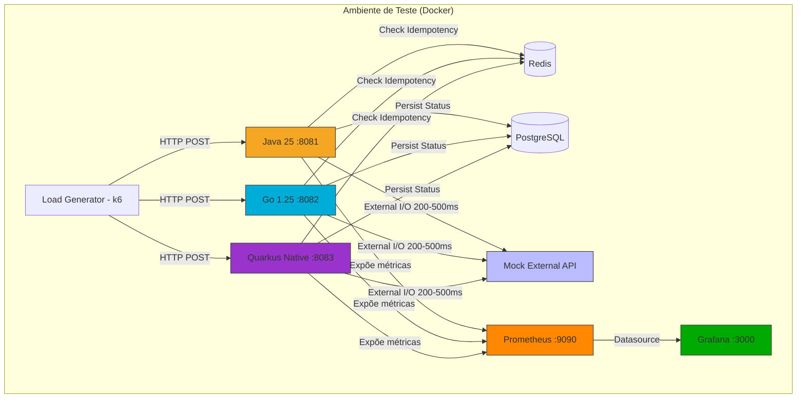
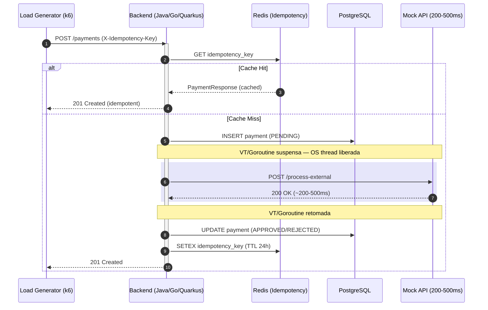

# TCC: Estudo Comparativo de Modelos de Concorrência — Java 25 vs Go 1.25 vs Quarkus Native

Este projeto realiza uma pesquisa científica e acadêmica comparando performance, footprint de memória e escalabilidade entre três modelos de concorrência em workloads I/O-bound:

| Backend | Runtime | Modelo de Concorrência |
|---|---|---|
| **Java 25** | JVM (ZGC) | Virtual Threads — M:N scheduling (Project Loom) |
| **Go 1.25** | Nativo | Goroutines — M:N scheduling (runtime Go) |
| **Quarkus Native** | Nativo (GraalVM Mandrel) | OS Threads — 1:1 blocking |

O cenário de teste simula um **Gateway de Pagamentos** com gargalo de I/O externo (200–500ms), projetado para revelar o comportamento de cada modelo sob carga crescente.

> **Autor:** Felippe Gustavo de Souza e Silva
> **Instituição:** USP ESALQ — Engenharia de Software
> **Orientador:** Prof. Marcos Jardel Henriques
> **Ano:** 2025

---

## Por que três backends?

A comparação Java vs Go isolada deixa uma ambiguidade: *a diferença de RAM é do modelo de concorrência ou da JVM?*

O Quarkus Native resolve essa questão:

- **Java vs Quarkus** — mesmo código Java, JVM vs binário nativo → isola o custo da JVM
- **Go vs Quarkus** — ambos nativos, sem JVM → isola **exclusivamente** o modelo de concorrência
- **Java vs Go** — confronta os dois modelos M:N entre si

Com os três, o experimento prova empiricamente que:
1. O custo de RAM do Java vem da JVM, não da linguagem
2. O colapso sob carga vem do modelo de threading, não da linguagem nem do runtime

---

## Resultados (Apple M4, Colima ARM64, pool=200, 3 rodadas)

### Baseline — 20 VUs, 2 minutos

| Métrica | Java 25 (VT) | Go 1.25 | Quarkus Native |
|---|---|---|---|
| Latência média | 359ms | 353ms | 358ms |
| Total requests | 2.912 | 2.953 | 2.919 |
| RAM pico | 753 MB | 61 MB | 56 MB |

**Todos empatam em performance.** Com carga leve, o gargalo é o I/O externo (200–500ms) — o modelo de threading não faz diferença. A única variável relevante é RAM: Java consome 13× mais que Go/Quarkus.

---

### Stress — 200 VUs, ~2 minutos

| Métrica | Java 25 (VT) | Go 1.25 | Quarkus Native |
|---|---|---|---|
| Latência média | 354ms | 352ms | 2.720ms |
| Total requests | 37.505 | 37.691 | 6.105 |
| Taxa de erro | 0% | 0% | 0% |
| RAM pico | 1.420 MB | 79 MB | 91 MB |

**Java e Go empatam completamente.** Virtual Threads e goroutines resolvem o I/O-bound da mesma forma. Quarkus com OS threads colapsa: 83% menos throughput, latência 7× maior. RAM: Go e Quarkus no mesmo tier (79 MB vs 91 MB) — Java 18× mais pesado.

---

### Spike — 500 VUs, 1 minuto

| Métrica | Java 25 (VT) | Go 1.25 | Quarkus Native |
|---|---|---|---|
| Latência média | 724ms | 353ms | 4.646ms |
| p50 | 751ms | 353ms | 5.008ms |
| p95 | 919ms | 488ms | 5.439ms |
| Total requests | 21.596 | 39.182 | 3.966 |
| Taxa de erro | 0% | 0.2% | 38.3% |
| RAM pico | 1.938 MB | 108 MB | 250 MB |

**Go domina.** Goroutines absorvem 500 VUs sem pressão: 39k requests, 353ms estável. Java com Virtual Threads sente contention (pool HikariCP, scheduler JVM) mas permanece funcional. Quarkus com OS threads entra em colapso parcial: 38% de erros, 250 MB de RAM (600 stacks de OS thread).

---

## Conclusões Científicas

**1. O custo de RAM é da JVM, não do Java**
Quarkus Native (Java AOT) usa 56–250 MB — equiparável ao Go (61–108 MB). Java JVM usa 753–1938 MB. A linguagem não é o problema; o runtime é.

**2. O modelo de concorrência determina performance sob carga**
Go e Java VT têm performance equivalente até carga extrema. OS threads (Quarkus) colapsam porque cada thread bloqueada esperando I/O é uma thread perdida. M:N scheduling (goroutines/VT) desmultiplexa o I/O sem desperdiçar threads.

**3. Programação reativa perdeu sua principal justificativa**
Reactive programming (Mutiny, Project Reactor) surgiu para compensar o custo das OS threads. Com Virtual Threads e goroutines, essa complexidade não se paga: o código permanece imperativo, síncrono e debugável com a mesma eficiência de I/O.

---

## Arquitetura do Sistema

Todos os três backends seguem **Clean Architecture** com as mesmas camadas e lógica de negócio. A única variável que muda entre eles é o framework e o modelo de concorrência — garantindo comparação justa.



### Fluxo de Processamento (I/O Bound)



---

## Stack Tecnológica

### Backend Java (`:8081`)
- **Runtime:** Java 25 + JVM ZGC Generational
- **Framework:** Spring Boot 3.5
- **Concorrência:** Virtual Threads (`spring.threads.virtual.enabled=true`)
- **Pool DB:** HikariCP 200 conexões
- **Cache:** Spring Data Redis
- **Métricas:** Micrometer + Actuator `/actuator/prometheus`

### Backend Go (`:8082`)
- **Runtime:** Go 1.25 (binário nativo)
- **Framework:** Gin
- **Concorrência:** Goroutines nativas
- **Pool DB:** pgxpool 200 conexões
- **Cache:** go-redis/v9
- **Métricas:** prometheus/client_golang `/metrics`

### Backend Quarkus Native (`:8083`)
- **Runtime:** GraalVM Mandrel (binário nativo, sem JVM)
- **Framework:** Quarkus 3.15.1 LTS
- **Concorrência:** OS Threads bloqueantes (modelo de contraste)
- **Pool DB:** Agroal 200 conexões
- **Cache:** quarkus-redis-client (blocking API)
- **Métricas:** Micrometer + `/actuator/prometheus`
- **Build:** `./mvnw package -Pnative` (~90s)

### Observabilidade
- **Prometheus** — scrape interval 5s nos 3 backends
- **Grafana** — dashboard pré-provisionado com cores distintas por backend (Java: laranja, Go: azul, Quarkus: roxo), 9+ painéis: throughput, latência, RAM RSS, in-flight requests, CPU, pool metrics

### Load Testing
- **Ferramenta:** k6
- **Cenários:**

| Cenário | VUs | Duração | Objetivo |
|---|---|---|---|
| `baseline` | 20 | 2 min | Comportamento sob carga controlada |
| `stress` | 200 | ~2 min | Saturação do modelo de concorrência |
| `spike` | 500 | 1 min | Rajada extrema — resiliência |

---

## Estrutura do Monorepo

```text
/
├── apps/
│   ├── backend-java/           # Spring Boot (Java 25 + Virtual Threads)
│   ├── backend-go/             # Gin (Go 1.25 + Goroutines)
│   ├── backend-quarkus/        # Quarkus 3.15.1 (GraalVM Mandrel Native + OS Threads)
│   └── mock-external-api/      # Simula adquirente externa (200-500ms latência)
├── results/
│   └── local_benchmarks/
│       └── THREE_WAY_BENCHMARK_REPORT.md  # Resultados comparativos completos
├── scripts/
│   ├── benchmarks/
│   │   ├── run_benchmarks.sh   # Runner automatizado (27 runs + FLUSHALL Redis)
│   │   ├── stress_test.js      # Script k6 (3 cenários)
│   │   └── analyze_results.py  # Análise estatística (média, desvio, deltas)
│   └── monitoring/
│       ├── prometheus.yml
│       └── grafana/
│           ├── provisioning/
│           └── dashboards/
│               └── tcc-comparison.json
├── postman/                    # Collections para testes manuais
├── docs/
│   └── METODOLOGIA_BENCHMARK.md
└── docker-compose.yml
```

---

## Como Executar

### 1. Subir a infraestrutura completa

```bash
docker compose up -d --build
```

Serviços iniciados:
- PostgreSQL (`:5432`)
- Redis (`:6379`)
- Mock External API (`:8080`)
- Backend Java (`:8081`)
- Backend Go (`:8082`)
- Backend Quarkus Native (`:8083`) — aguarde ~2s para o binário nativo inicializar
- Prometheus (`:9090`)
- Grafana (`:3000`)

> **Nota:** O build do Quarkus Native leva ~90s na primeira vez (compilação GraalVM AOT). Builds subsequentes usam cache Docker.

### 2. Executar a bateria completa de benchmarks

```bash
bash scripts/benchmarks/run_benchmarks.sh
```

Executa 27 runs (3 backends × 3 cenários × 3 rodadas) com FLUSHALL Redis antes de cada run. Resultados salvos em `results/runs/<timestamp>/`.

### 3. Gerar relatório estatístico

```bash
# Texto (terminal)
python3 scripts/benchmarks/analyze_results.py results/runs/<timestamp>

# Markdown
python3 scripts/benchmarks/analyze_results.py results/runs/<timestamp> --format markdown
```

### 4. Acessar observabilidade

- **Grafana:** `http://localhost:3000` — dashboard `TCC — Java 25 vs Go 1.25 vs Quarkus Native` carregado automaticamente
- **Prometheus:** `http://localhost:9090`
- **Swagger Java:** `http://localhost:8081/swagger-ui.html`
- **Swagger Go:** `http://localhost:8082/swagger/index.html`
- **Swagger Quarkus:** `http://localhost:8083/swagger-ui.html`

### 5. Teardown completo (limpa volumes)

```bash
docker compose down --volumes
```

---

## Metodologia

- **Redis FLUSHALL** antes de cada run — evita que cache de idempotência de testes anteriores mascare resultados
- **`X-Idempotency-Key` único por VU/iteração** — garante que todas as requisições percorram o fluxo completo de I/O
- **3 rodadas por cenário/backend** — média e desvio padrão para estabilidade estatística
- **RAM capturada via `docker stats`** em paralelo durante cada run — footprint real em tempo de execução
- **Pool de conexões 200** em todos os backends — configuração simétrica

Relatório completo de metodologia: [`docs/METODOLOGIA_BENCHMARK.md`](docs/METODOLOGIA_BENCHMARK.md)
