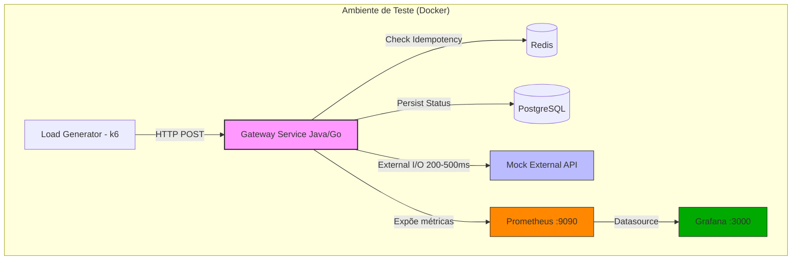
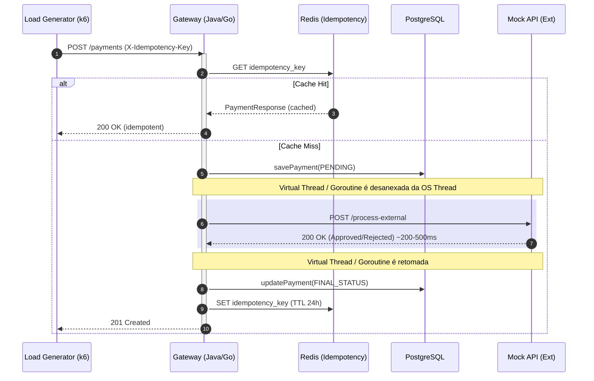

# TCC: Estudo Comparativo de Concorrência - Java 25 vs Go 1.25

Este projeto tem como objetivo realizar uma pesquisa científica e acadêmica comparando a performance, o footprint de memória e o comportamento de escalabilidade entre as **Virtual Threads (Project Loom)** do **Java 25** e as **Goroutines** da linguagem **Go 1.25**.

O cenário de teste simula um ambiente de alta concorrência focado em gargalos de **I/O Bound**: um Gateway de Pagamentos.

> **Autor:** Felippe Gustavo de Souza e Silva
> **Instituição:** USP ESALQ — Engenharia de Software
> **Orientador:** Prof. Marcos Jardel Henriques
> **Ano:** 2025

---

## 🏗️ Arquitetura do Sistema

Ambos os backends (Java e Go) foram desenvolvidos seguindo rigorosamente as premissas da **Clean Architecture** e os princípios **SOLID**. Isso garante que a comparação seja feita "maçã com maçã", onde a lógica de negócio é idêntica e a única variável que muda é a tecnologia subjacente e o modelo de concorrência.

### Padrões Aplicados:
*   **Isolamento de Domínio:** As entidades de negócio não conhecem frameworks ou bancos de dados.
*   **Inversão de Dependência (DIP):** Use Cases interagem com adaptadores através de interfaces.
*   **Responsabilidade Única (SRP):** Uso extensivo de Mappers dedicados (MapStruct no Java, mapeamento explícito no Go) e DTOs para separar as camadas de rede e persistência da lógica core.
*   **Fail-Fast & Tuning:** O pool de conexões (HikariCP / pgxpool) foi dimensionado para 50 conexões, com timeouts curtos para evidenciar o gerenciamento de threads sem mascarar falhas no banco.
*   **Idempotência:** Ambos os backends implementam verificação de idempotência via `X-Idempotency-Key` com TTL de 24h no Redis, garantindo simetria científica no comportamento sob retries.

### Visão Geral da Infraestrutura



## 🔄 Fluxo de Processamento de Pagamento (I/O Bound)

O ponto crítico para o TCC é o **tempo de espera (I/O Wait)** enquanto o backend aguarda o Banco de Dados e, principalmente, a API Externa.



---

## 🛠️ Stack Tecnológica

### Backend Java
*   **Linguagem:** Java 25 (LTS)
*   **Framework:** Spring Boot 3.5+
*   **Concorrência:** Virtual Threads (`spring.threads.virtual.enabled=true`)
*   **Pinning Detection:** `-Djdk.tracePinnedThreads=full`
*   **GC:** ZGC Generational (`-XX:+UseZGC -XX:+ZGenerational`)
*   **Database:** Spring Data JPA + Hibernate + HikariCP (max 50 conexões)
*   **Cache/Idempotência:** Spring Data Redis + `StringRedisTemplate`
*   **Mapeamento:** MapStruct
*   **HTTP Client:** Spring `RestClient` com timeout de 5s (otimizado para Loom)
*   **Métricas:** Micrometer + Actuator (`/actuator/prometheus`)

### Backend Go
*   **Linguagem:** Go 1.25
*   **Framework HTTP:** Gin (`gin-gonic`)
*   **Concorrência:** Goroutines nativas + `net/http`
*   **Database:** `pgxpool` (Driver oficial de alta performance para Postgres, max 50 conexões)
*   **Cache/Idempotência:** `go-redis/v9` com TTL de 24h
*   **HTTP Client:** `net/http` com timeout de 5s
*   **Métricas:** `prometheus/client_golang` — middleware customizado com labels simétricos ao Java (`/metrics`)
*   **Arquitetura:** Injeção de dependência manual (idiomática)

### Observabilidade
*   **Documentação:** OpenAPI 3 / Swagger (`springdoc` no Java, `swaggo` no Go)
*   **Coleta de Métricas:** Prometheus (scrape interval 5s em ambos os backends)
*   **Dashboards:** Grafana com dashboard pré-provisionado (`tcc-comparison`) — 9 painéis: Throughput, p95, p99, Error Rate, VT vs Goroutines, Memory, CPU, OS Threads (Go), GC Pauses

### Load Testing
*   **Ferramenta:** k6
*   **Cenários:**
    | Cenário | VUs | Descrição |
    |---------|-----|-----------|
    | `baseline` | 20 | Comportamento sob carga controlada |
    | `stress` | 200 | Saturação progressiva do modelo de concorrência |
    | `spike` | 500 | Rajada abrupta — resiliência sob carga extrema |

---

## 📁 Estrutura do Monorepo

```text
/
├── apps/
│   ├── backend-java/           # Aplicação Spring Boot (Java 25 + Virtual Threads)
│   ├── backend-go/             # Aplicação Gin (Go 1.25 + Goroutines)
│   └── mock-external-api/      # Serviço Go que simula latência de adquirente (200-500ms)
├── postman/                    # Collections para testes manuais (Java e Go)
├── scripts/
│   ├── benchmarks/
│   │   └── stress_test.js      # Script k6 com 3 cenários científicos
│   └── monitoring/
│       ├── prometheus.yml       # Configuração de scrape do Prometheus
│       └── grafana/
│           ├── provisioning/    # Datasource e dashboard auto-provisionados
│           └── dashboards/
│               └── tcc-comparison.json  # Dashboard científico (9 painéis)
├── METRICS.md                  # Documentação das métricas coletadas para o TCC
└── docker-compose.yml          # Orquestração completa do ambiente
```

---

## 🚀 Como Executar e Testar Localmente

### 1. Subir a Infraestrutura Completa
Na raiz do projeto, execute:
```bash
docker-compose up -d --build
```
Isso iniciará todos os serviços com healthchecks e ordem de dependência garantida:
*   PostgreSQL (`:5432`)
*   Redis (`:6379`)
*   Mock External API (`:8080`)
*   Backend Java (`:8081`)
*   Backend Go (`:8082`)
*   Prometheus (`:9090`)
*   Grafana (`:3000`)

### 2. Acessar a Documentação (Swagger)
*   **Java:** [http://localhost:8081/swagger-ui.html](http://localhost:8081/swagger-ui.html)
*   **Go:** [http://localhost:8082/swagger/index.html](http://localhost:8082/swagger/index.html)

### 3. Acessar o Dashboard de Observabilidade
*   **Grafana:** [http://localhost:3000](http://localhost:3000) — login: `admin` / `admin`
    *   Dashboard `TCC — Java 25 vs Go 1.25` é carregado automaticamente
*   **Prometheus:** [http://localhost:9090](http://localhost:9090)

### 4. Testes Manuais (Postman)
Na pasta `/postman`, existem duas collections (`TCC_Java_25_Collection.json` e `TCC_Go_125_Collection.json`). Importe-as no Postman para validar o caminho feliz, erros de validação e o comportamento de idempotência via `X-Idempotency-Key`.

### 5. Executar os Benchmarks (k6)

O script suporta 3 cenários via variável de ambiente `SCENARIO`:

**Baseline (20 VUs) — carga controlada:**
```bash
# Java
k6 run -e TARGET_URL=http://localhost:8081/payments -e SCENARIO=baseline scripts/benchmarks/stress_test.js

# Go
k6 run -e TARGET_URL=http://localhost:8082/payments -e SCENARIO=baseline scripts/benchmarks/stress_test.js
```

**Stress (200 VUs) — saturação progressiva:**
```bash
# Java
k6 run -e TARGET_URL=http://localhost:8081/payments -e SCENARIO=stress scripts/benchmarks/stress_test.js

# Go
k6 run -e TARGET_URL=http://localhost:8082/payments -e SCENARIO=stress scripts/benchmarks/stress_test.js
```

**Spike (500 VUs) — rajada extrema:**
```bash
# Java
k6 run -e TARGET_URL=http://localhost:8081/payments -e SCENARIO=spike scripts/benchmarks/stress_test.js

# Go
k6 run -e TARGET_URL=http://localhost:8082/payments -e SCENARIO=spike scripts/benchmarks/stress_test.js
```

> **Nota científica:** Cada cenário usa `X-Idempotency-Key` único por VU/iteração (`k6-vu${VU}-iter${ITER}`), garantindo que nenhuma requisição seja servida do cache Redis — todas passam pelo fluxo completo de I/O.

### 6. Métricas Raw do Prometheus
*   **Java:** [http://localhost:8081/actuator/prometheus](http://localhost:8081/actuator/prometheus)
*   **Go:** [http://localhost:8082/metrics](http://localhost:8082/metrics)

Ambos expõem a mesma métrica-chave: `http_server_requests_seconds` com labels `{method, uri, status, outcome}` — simetria intencional para queries idênticas no Grafana.
