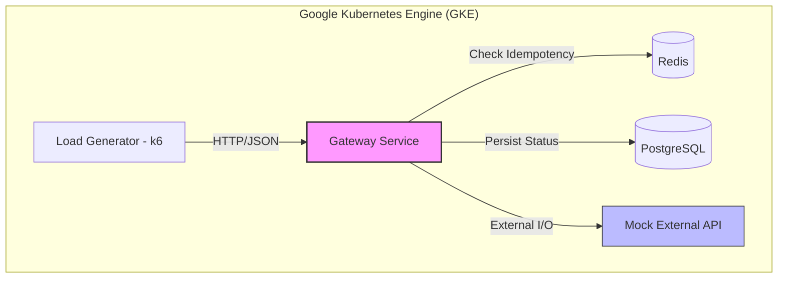
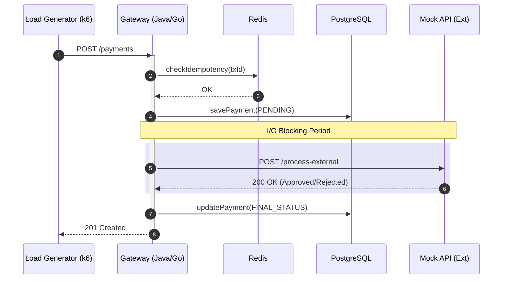

# TCC: Estudo Comparativo de Concorrência - Java 25 vs Go

Este projeto tem como objetivo comparar a performance e o comportamento de escalabilidade entre as **Virtual Threads (Project Loom)** do Java 25 e as **Goroutines** da linguagem Go, utilizando um cenário de alta concorrência em um Gateway de Pagamentos.

## 🏗️ Arquitetura do Sistema

O projeto utiliza **Clean Architecture** em ambos os backends para garantir que a lógica de negócio seja idêntica, isolando as diferenças apenas na camada de infraestrutura e gerenciamento de threads.

### Visão Geral da Infraestrutura (GCP/GKE)



## 🔄 Fluxo de Processamento de Pagamento

O diagrama abaixo detalha o caminho de uma requisição. O ponto crítico para o TCC é o **tempo de espera (I/O Wait)** enquanto o backend aguarda o Banco de Dados e a API Externa.



## 📁 Estrutura do Monorepo

```text
/apps
  ├── /backend-java         # Spring Boot 3.6 + Java 25 (Virtual Threads)
  ├── /backend-go           # Go 1.24+ + Gin (Goroutines)
  └── /mock-external-api    # Simulador de latência externa
/infra
  ├── /terraform            # IaC para GKE, VPC e Cloud SQL
  └── /k8s                  # Manifestos (Deployments, Services, HPA)
/scripts
  └── /benchmarks           # Scripts k6 de Stress Test e Spike Test
```

## 📊 Métricas Comparativas

Para a monografia, serão extraídas as seguintes métricas:

1.  **Throughput (RPS):** Requisições por segundo suportadas com sucesso.
2.  **Latência (P95/P99):** Estabilidade da resposta sob carga.
3.  **Memory Footprint:** Consumo de RAM por thread/goroutine em repouso e em carga.
4.  **CPU Context Switching:** Quantidade de trocas de contexto no kernel do Linux (GKE Nodes).

## 🚀 Como Iniciar

### Pré-requisitos
- Docker & Docker Compose
- JDK 25 (para o backend Java)
- Go 1.24+ (para o backend Go)

### Execução Local
1. Suba os serviços de apoio: `docker-compose up -d`
2. Configure as Virtual Threads no Java: `spring.threads.virtual.enabled=true`
3. Execute o backend desejado e inicie os testes em `/scripts/benchmarks`.
