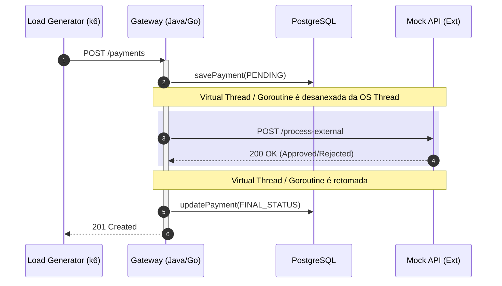

# TCC: Estudo Comparativo de Concorrência - Java 25 vs Go 1.25

Este projeto tem como objetivo realizar uma pesquisa científica e acadêmica comparando a performance, o footprint de memória e o comportamento de escalabilidade entre as **Virtual Threads (Project Loom)** do **Java 25** e as **Goroutines** da linguagem **Go 1.25**.

O cenário de teste simula um ambiente de alta concorrência focado em gargalos de **I/O Bound**: um Gateway de Pagamentos.

---

## 🏗️ Arquitetura do Sistema

Ambos os backends (Java e Go) foram desenvolvidos seguindo rigorosamente as premissas da **Clean Architecture** e os princípios **SOLID**. Isso garante que a comparação seja feita "maçã com maçã", onde a lógica de negócio é idêntica e a única variável que muda é a tecnologia subjacente e o modelo de concorrência.

### Padrões Aplicados:
*   **Isolamento de Domínio:** As entidades de negócio não conhecem frameworks ou bancos de dados.
*   **Inversão de Dependência (DIP):** Use Cases interagem com adaptadores através de interfaces.
*   **Responsabilidade Única (SRP):** Uso extensivo de Mappers dedicados (MapStruct no Java, mapeamento explícito no Go) e DTOs para separar as camadas de rede e persistência da lógica core.
*   **Fail-Fast & Tuning:** O pool de conexões (HikariCP / pgxpool) foi dimensionado para 50 conexões, com timeouts curtos para evidenciar o gerenciamento de threads sem mascarar falhas no banco.

### Visão Geral da Infraestrutura


## 🔄 Fluxo de Processamento de Pagamento (I/O Bound)

O ponto crítico para o TCC é o **tempo de espera (I/O Wait)** enquanto o backend aguarda o Banco de Dados e, principalmente, a API Externa.



---

## 🛠️ Stack Tecnológica

### Backend Java
*   **Linguagem:** Java 25 (LTS)
*   **Framework:** Spring Boot 3.5+
*   **Concorrência:** Virtual Threads (`spring.threads.virtual.enabled=true`)
*   **Database:** Spring Data JPA + Hibernate + HikariCP
*   **Mapeamento:** MapStruct
*   **HTTP Client:** Spring `RestClient` (Otimizado para Loom)

### Backend Go
*   **Linguagem:** Go 1.25
*   **Framework HTTP:** Gin (`gin-gonic`)
*   **Concorrência:** Goroutines nativas + `net/http`
*   **Database:** `pgxpool` (Driver oficial de alta performance para Postgres)
*   **Arquitetura:** Injeção de dependência manual (Idiomática)

### Observabilidade e Documentação (Ambos)
*   **Documentação:** OpenAPI 3 / Swagger (`springdoc` no Java, `swaggo` no Go)
*   **Métricas Científicas:** Prometheus Endpoint (Actuator no Java, `client_golang` no Go)

---

## 📁 Estrutura do Monorepo

```text
/
├── apps/
│   ├── backend-java/       # Aplicação Spring Boot
│   ├── backend-go/         # Aplicação Gin
│   └── mock-external-api/  # Serviço Go que simula a demora de adquirentes (300ms)
├── postman/                # Collections prontas para testes manuais
├── scripts/
│   └── benchmarks/         # Scripts k6 de Stress Test (`stress_test.js`)
├── METRICS.md              # Documentação das métricas coletadas para o TCC
└── docker-compose.yml      # Orquestração local do ambiente
```

---

## 🚀 Como Executar e Testar Localmente

### 1. Subir a Infraestrutura Base
Na raiz do projeto, execute:
```bash
docker-compose up -d --build
```
Isso iniciará:
*   PostgreSQL (`:5432`)
*   Redis (`:6379`)
*   Mock API (`:8080`)
*   Backend Java (`:8081`)
*   Backend Go (`:8082`)

### 2. Acessar a Documentação (Swagger)
*   **Java:** [http://localhost:8081/swagger-ui.html](http://localhost:8081/swagger-ui.html)
*   **Go:** [http://localhost:8082/swagger/index.html](http://localhost:8082/swagger/index.html)

### 3. Testes Manuais (Postman)
Na pasta `/postman`, existem duas collections (`TCC_Java_25_Collection.json` e `TCC_Go_125_Collection.json`). Importe-as no seu Postman para validar o Caminho Feliz e os Erros de Validação.

### 4. Executar os Benchmarks (K6)
Para iniciar a "Batalha das Linguagens" e coletar as métricas na sua máquina:

**Testar Java:**
```bash
k6 run -e TARGET_URL=http://localhost:8081/payments scripts/benchmarks/stress_test.js
```

**Testar Go:**
```bash
k6 run -e TARGET_URL=http://localhost:8082/payments scripts/benchmarks/stress_test.js
```

Para visualizar as métricas do Prometheus e o comportamento de threads/goroutines localmente:
*   **Java:** [http://localhost:8081/actuator/prometheus](http://localhost:8081/actuator/prometheus)
*   **Go:** [http://localhost:8082/metrics](http://localhost:8082/metrics)
