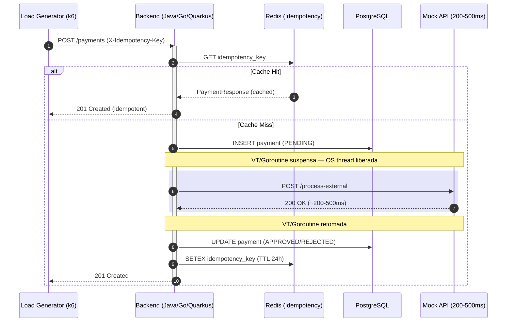

# TCC: Estudo Comparativo de Modelos de Concorrência — Java 25 vs Go 1.25 vs Quarkus Native

Este projeto realiza uma pesquisa científica e acadêmica comparando performance, footprint de memória (FinOps) e escalabilidade elástica entre três modelos de concorrência em workloads I/O-bound:

| Backend | Runtime | Modelo de Concorrência |
|---|---|---|
| **Java 25** | JVM (ZGC) | Virtual Threads — M:N scheduling (Project Loom) |
| **Go 1.25** | Nativo | Goroutines — M:N scheduling (runtime Go) |
| **Quarkus Native** | Nativo (GraalVM Mandrel) | OS Threads — 1:1 blocking |

O cenário de teste simula um **Gateway de Pagamentos** com gargalo de I/O externo (200–500ms), desenhado para revelar o comportamento de cada modelo sob carga contínua (Stress) e pico abrupto (Spike).

> **Autor:** Felippe Gustavo de Souza e Silva  
> **Instituição:** USP ESALQ — Engenharia de Software  
> **Orientador:** Prof. Marcos Jardel Henriques  
> **Ano:** 2026

---

## Estrutura da Pesquisa em Duas Fases

Para garantir o rigor científico, a avaliação foi separada em duas etapas:

- **Fase 1 (Limites em Hardware Local):** Isola os contêineres Docker em arquitetura ARM64 (Apple M4), sem latência de rede entre os nós, para entender o limite absoluto da CPU e o impacto do modelo `1:1` vs `M:N`.
- **Fase 2 (Elasticidade Produtiva em Nuvem GKE):** Provisiona um cluster real no Google Kubernetes Engine (arquitetura X86_64, Nodes Dedicados). Avalia a resposta do runtime sob *Cold-Start* e afere o impacto econômico (Densidade/FinOps) baseado na alocação de memória RAM na nuvem.

---

## Principais Resultados Científicos

Os resultados apontam para uma especialização clara dos runtimes dependendo do cenário de tráfego.

### 1. Stress Sustentado (200 VUs) — O JIT Compiler Vence
Quando os contêineres estão aquecidos e sob carga alta e contínua:
- **Java 25** entregou a maior vazão horizontal absoluta (**290 RPS** em nuvem), beneficiando-se fortemente das otimizações dinâmicas do compilador Just-in-Time (JIT) sobre as Virtual Threads.
- Go e Quarkus mantiveram-se levemente atrás (263 RPS e 142 RPS), limitados apenas pela ausência dessas otimizações em tempo de execução de código nativo AOT (Ahead-of-Time).

### 2. Spike Abrupto (500 VUs) — O Triunfo do Go e do AOT
Quando um pico extremo e repentino atinge o cluster *frio*:
- **Go 1.25** demonstrou resiliência elástica incomparável. Manteve **274 RPS**, com uma latência de cauda (p95) perfeitamente controlada em **1,3s**. Sua compilação AOT evitou o estrangulamento.
- **Java 25 colapsou**. A vazão caiu para 144 RPS e o P95 estourou para inaceitáveis **4,2s**. A falha não ocorreu nas Virtual Threads em si (o JEP 491 não apresentou pinning), mas sim **na imaturidade de bibliotecas clássicas** (como o pool HikariCP), que usam blocos de `synchronized` pesados criando extrema contenção de locks de inicialização no JVM.

### 3. Custo Operacional (FinOps & Densidade em K8s)
O calcanhar de Aquiles da linguagem Java ficou escancarado na medição final de nuvem:
- O **Go** exigiu um pico máximo absoluto de **75 MB** de RAM para sustentar o estresse.
- O **Quarkus Native** confirmou o custo estrutural pesado das OS Threads 1:1, batendo em **305 MB**.
- O **Java 25** puxou massivos **733 MB** alocados pela JVM.
**Conclusão FinOps:** Em ambientes Serverless/Kubernetes (como o GKE), a pegada das Goroutines permite um adensamento de instâncias (pods) quase **10x superior** ao Java, provando que o ecossistema Go é economicamente imbatível para Gateways I/O-bound.

---

## Arquitetura do Sistema e Fluxo (Clean Architecture)


```mermaid
sequenceDiagram
    autonumber
    participant C as Load Generator (k6)
    participant B as Backend (Java/Go/Quarkus)
    participant RD as Redis (Idempotency)
    participant DB as PostgreSQL
    participant M as Mock API (200-500ms)

    C->>B: POST /payments (X-Idempotency-Key)
    activate B
    B->>RD: GET idempotency_key
    alt Cache Hit
        RD-->>B: PaymentResponse (cached)
        B-->>C: 201 Created (idempotent)
    else Cache Miss
        B->>DB: INSERT payment (PENDING)
        Note over B,M: VT/Goroutine suspensa — OS thread liberada
        rect rgb(230, 230, 250)
            B->>M: POST /process-external
            M-->>B: 200 OK (~200-500ms)
        end
        Note over B,M: VT/Goroutine retomada
        B->>DB: UPDATE payment (APPROVED/REJECTED)
        B->>RD: SETEX idempotency_key (TTL 24h)
        B-->>C: 201 Created
    end
    deactivate B
```

---

## Como Executar - Fase 1 (Local via Docker Compose)

```bash
# 1. Subir a infraestrutura
docker compose up -d --build

# 2. Executar a bateria completa automatizada (inclui testes com Flushall rigoroso)
bash scripts/benchmarks/run_benchmarks.sh

# 3. Gerar documento base final da monografia via script docx
docker run --rm -v "$(pwd):/app" -w /app python:3.11 bash -c "pip install python-docx && python results/local_benchmarks/gera_tcc.py"
```

## Como Executar - Fase 2 (Nuvem GKE)

```bash
# 1. Autenticar no GCP e conectar ao cluster GKE
gcloud auth login
gcloud container clusters get-credentials SEU_CLUSTER --region us-central1

# 2. Aplicar recursos da infraestrutura K8s
kubectl apply -f k8s/infra/namespace.yaml
kubectl apply -f k8s/infra/postgres.yaml
kubectl apply -f k8s/infra/redis.yaml
kubectl apply -f k8s/infra/mock-api.yaml

# 3. Executar o Job automatizado de Benchmark em nuvem
bash scripts/benchmarks/run_benchmarks_gke.sh
```

---

## Metodologia de Prevenção de Vieses

- **Redis FLUSHALL** executado obrigatoriamente antes de cada run para evitar contaminação do cache de idempotência.
- **`X-Idempotency-Key` único por VU/iteração** injetado nativamente no script `stress_test.js` e `k6-job.yaml`.
- **Node Affinity no GKE:** Separação absoluta entre Nodes de Testadores (k6) e Banco de Dados, isolando o processo das VTs de anomalias de "noisy neighbors".

Relatórios completos localizam-se na pasta `results/`.
